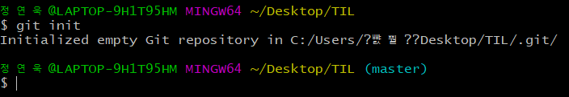

# Git Command

> Git 명령어 정리

## 초기설정

### 0. init

- `git init`
- `.git/` 폴더를 생성해준다.

- `.git` 폴더가 생성된 경우 오른쪽에 `master`라는 표시가 나온다.
- 최초에 한번만 하면 된다.

### 1. config

- `git config --global user.email "myemail@email.com"`
  - 이메일의 경우 깃허브에 올릴 경우 잔디가 심어지는 기준이므로 정확하게 입력!
- `git config --global user.name "myname"`
- 최초에 한 번만 하면 된다.

## 커밋 기록

### 1. add

- `git add <추가하고 싶은 파일>`
  - `git add .`: 현재 폴더의 모든 파일과 폴더를 add
- working directory => staging area로 파일 이동

### 2. commit

- `git commit -m "메시지"`
  - `git commit -am ""` : add와 commit을 동시에 시행
- 스냅샷을 찍는 동작
- add되어 있는 파일들을 하나의 묶음으로 저장
- 메시지에 들어가는 내용은 기능 단위로

### 3. remote

- `git remote add origin <주소>`
- 원격 저장소와 현재 로컬 저장소를 연결.

### 4. push

- `git push origin master`
- '깃아 올려줘 origin으로 master를'
- 원격저장소에 로컬 저장소의 데이터를 전송

## 상태확인

### 1. status

- `git status`
- 현재 git 상태를 출력

### 2. log

- `git log`
- 커밋 기록을 전체 다 출력

- 옵션
  - `--oneline` : author, date 같은 정보를 제외하고 한 줄로 출력
  - `--graph` : 커밋들을 점으로 표현하고 그 커밋을 선으로 연결해서 그래프 형태로 출력
  - `--branches` : 현재 브랜치에 속하지 않은 커밋까지 표시
  - `-p` : 각 커밋의 diff 결과 출력
  - `-<숫자>` : 최근 n개의 커밋 출력
  - `--stat` : 각 커밋의 통계 정보
  - `git log <A>..<B>` : A와 B 브랜치 간 비교
### 3. diff

- `git diff`
- 현재 변경사항을 보여줌
  - `git diff <A>..<B>` : A와 B 브랜치 간 코드 비교

## 추가파일

### 1. gitignore

- `.gitignore` 파일을 생성 후 git으로 관리하고 싶지 않은 파일들을 저장

- [gitignore]: gitignore.io

## 브랜치

### 0. 보기

- `git branch` : 모든 브랜치 목록 보기

### 1. 생성

- `git branch <브랜치 이름>`

### 2. 이동

- ` git switch <브랜치 이름>` => 최신문법
  - ` git switch -b <브랜치 이름>` : 브랜치를 생성하고 전환
- ` git checkout <브랜치 이름>` => 조금 더 예전 문법

### 3. 삭제

- `git branch -d <브랜치 이름>`
- `git branch -d <브랜치 이름>` : 병합하지 않은 브랜치 강제 삭제

### 4. 병합

- `git merge <브랜치 이름>`
- base가 되는 branch로 이동해서 명령어 사용
- 충돌이 발생한 경우 => 충돌을 해결하고 다시 add, commit, push 