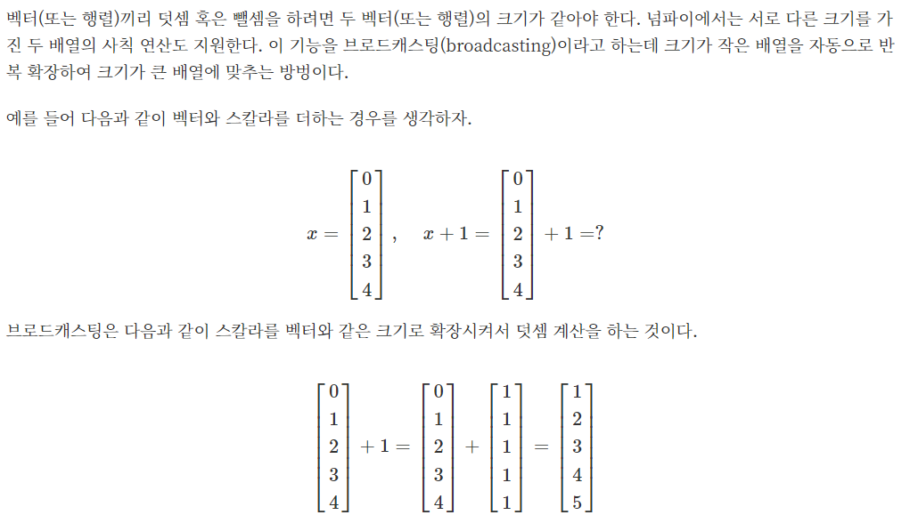
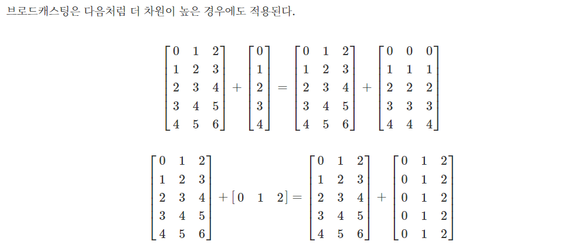

# NumPy 2~3일차

#### 배열의 확장
- `hstack(행렬목록)` : 목록의 행렬을 가로 방향으로 붙임 
- `vstack(행렬목록)` : 목록의 행렬을 세로 방향으로 붙임
- `dstack(행렬목록)`
- `stack(행렬목록, [axis])`
- `r_()` : 벡터를 가로로 한 다음 붙임
- `c_()` : 벡터를 세로로 한 다음 붙임
- `tile(row, col)` : 같은 행렬을 세로로 row, 가로로 col개 붙임

#### 특정 행/열 삭제 : delete

`delete(arr, idx, axis=[0|1])`

- `axis=0` : 행 삭제
- `axis=1` : 열 삭제

#### 브로드캐스팅

#### ndarray 정렬
- `sort(arr, axis=[0|1])` - 정렬된 결과 배열을 반환`
  - `axis=0` : 열 정렬
  - `axis=1` : 행 정렬
- `ary.sort()` - 원본 데이터의 정렬
- `argsort()` : 정렬된 인덱스값을 반환

#### 기술통계함수(desriptive statistics)
- `mean(arr)` : 평균
- `var(arr)` : 분산
- `std(arr)` : 표준편차
- `max(arr)` : 최댓값
- `min(arr)` : 최솟값
- `median(arr)` : 중위수
- `quartile(arr, n)` : n백분위수

#### 난수 함수

- `np.random.seed(seed_num)` : seed 설정
- `np.random.rand(size)` : 크기만큼의 난수를 생성, 같은 seed_num의 경우 같은 값이 생성됨
- `np.random.randn(size)` : 정규분포
- `np.random.randint(start, end, size)` : 정수의 난수를 리턴하는 함수

#### 데이터 샘플링

`np.random.choice(range, size, replace, p)`

- range : 범위, size : 크기, replace : 중복 여부, p : 각 원소가 나타날 확률(list)

